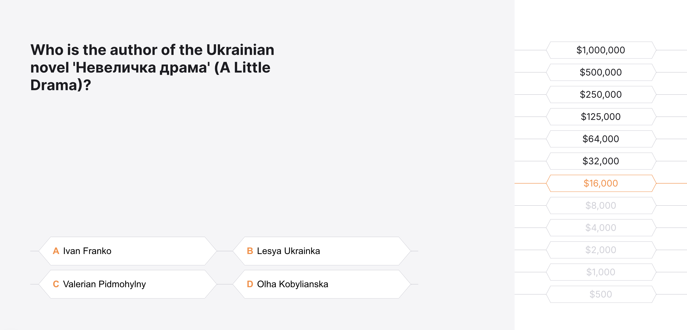

# Who Wants to Be a Millionaire?

A fun and interactive quiz game. Built with **Next.js**, **React**, **TypeScript**, **SCSS**, and **Redux**.

---

## Tech Stack

- [Next.js](https://nextjs.org/)
- [React](https://reactjs.org/)
- [TypeScript](https://www.typescriptlang.org/)
- [SCSS](https://sass-lang.com/)
- [Redux Toolkit](https://redux-toolkit.js.org/)

---

## Game Features

- 12 questions
- 4 choice answers
- Money rewards
- Responsive design

---

## Preview





---

## Getting Started

### Clone the repo

```bash
git clone https://github.com/annaprusakova/millionaire-quiz.git
cd millionaire-quiz
```
### Install dependencies

```bash
npm install
```

### Run in development

```bash
npm run dev
```

### Build for production

```bash
npm run build
npm start
```

---
## Project Structure

```bash
/apps         → App logic and higher-level flow  
/appPages     → Page-level components (Next.js routing)  
/components   → Reusable UI components  
/data         → Static question data and rewards  
/store        → Redux store and slices  
/styles       → SCSS styles
/types        → TypeScript type definitions  
/utils        → Helper and utility functions  
```

